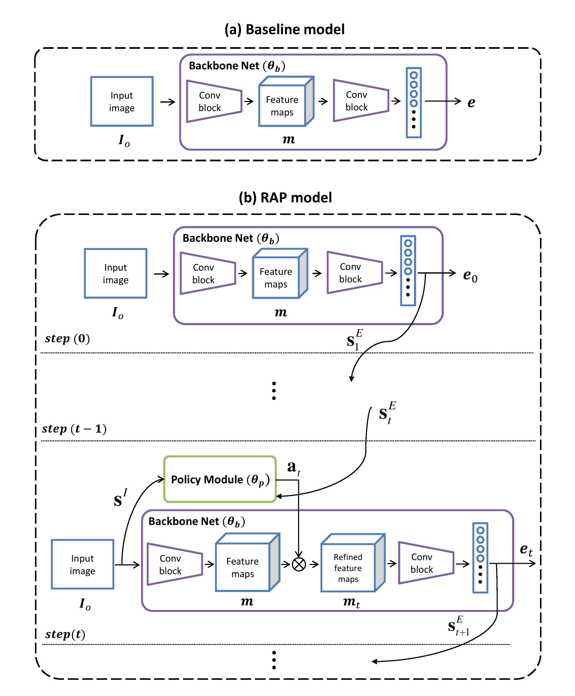
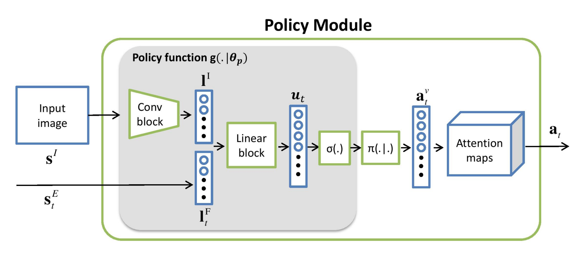
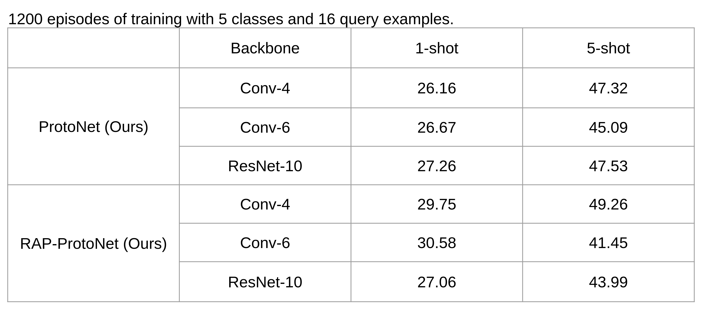

# Reinforced Attention for Few-Shot Learning and Beyond (RAP)

This readme file is an outcome of the [CENG502 (Spring 2022)](https://ceng.metu.edu.tr/~skalkan/ADL/) project for reproducing a paper without an implementation. See [CENG502 (Spring 2022) Project List]([https://github.com/sinankalkan/CENG502-Spring2021](https://github.com/CENG502-Projects/CENG502-Spring2022)) for a complete list of all paper reproduction projects.

# 1. Introduction

Authors: Jie Hong, Pengfei Fang, Weihao Li, Tong Zhang, Christian Simon, Mehrtash Harandi, Lars Petersson

*CVPR 2021*

## 1.1. Paper summary

Deep learning models achived promising accuricies depending on large labeled datasets. On the other side, few shot learning gained acceleration as there are numerous unlabeled data. In that direction, few shot learning methods seek for better representation with a few labeled instance. There are two divisions, namely model-initialization based methods and metric-learning based methods. Throughout this implementation, we will focus on metric-learning based methods. In these methods, there is a backbone which distills features from raw images. Then, few shot learning method tries to manipulate features computed by backbone. As a result of that manipulation, it gathers meaningful representations for instances.  

There are works to include spatial information of features. However, most of the work exclude this observation that lead to background sensitive models. Furthermore, attention models showed succes in language domain and presented strong direction. Apart from that, there are methods proposed using attention in few shot learning. In short, these models require complex design of manipulation.  

In this work, authors propose recurrent attention mechanism integrated with reinforcement learning. They treat feature extraction of backbone as Markov Decision Process (MDP). Moreover, they manipulate feature extraction process at each step by directly affecting inner layers of backbone with attention. To train reinforcement learning (RL) agent, agent decides attention and gets reward according to validation loss at each step. An episode consists of consecutive steps where agent uses the same image and features of previous steps. As a result, authors propose using consecutive process with RL, instead of complex designs.

Below, authors present novelty of proposed report with respect to methods in literature and authors present one episode of RL. We further investigate one step of this figure.

# 2. The method and my interpretation

## 2.1. The original method

Reinforcement learning studies consist of three limb: state, action and reward.

### State
State is represented with image itself and previous embeddings. Note that, previous embeddings are manipulated with reinforced attention.

$s_t = \{s^I=I_0, s_t^E=e_t\}$
where $I_0\in\mathcal{R}^{H\times W \times 3}$ and $e^t \in \mathcal{R}^{N_{SE} \times 1}$.
Dimension of the previous embedding is determined by hired backbone. At this point, authors discuss the state representation. Agent takes previous embedding in order to account high level features. Besides, it takes raw image in order to gather low level features.  

### Action 

Attention that is computed at time step $t$ is $a_t \in \mathcal{R}^{h \times w \times c}$. Note that the notation uses $h$ instead of $H$. This indicates, attention resolution is dependent on feature map size. The agent takes action in the dimension of $\mathcal{R}^{hw\times 1}$, then, this attention is reshaped. Agent draws action from the distribution $\pi: a^v_t \sim \pi(\cdot|g(s_t|)) $ where policy function $g$ produces means for Gaussian policy $\pi$. There could be other policies, however, this implementation follows the Gaussian policy which is mentioned in the paper. Having sampling and reshaping, $a_t \in \mathcal{R}^{h \times w \times c}$ is obtained. Then it is applied to the feature map $m_t$.   
$m_t = a_t \otimes m$

### Reward

Reward is taken after each application of attention. It measures the performance on validation data (i.e. held-out data). Note on supervised learning: since there are datasets with no validation set (like CIFAR10), we used PyTorch's random split methods and decided the split sizes from the paper.  
$r_t = -\alpha l_{val,t}$, where $\alpha$ is scaling factor.   
Authors states that accounting validation set into the reward results in better generalization.

### Policy Design

Above figure shows the process of estimating $a_t$. States of agent, raw image and previous embeddings, can be seen. In order to extract low level features from image, there exists a Conv Block. It has common structure with convolutional block used in literature. A block starts with Convolution followed by Batch Normalization. Then, ReLU non linearity is applied which is followed by Max Pooling. Authors discuss the depth of Conv Block. Since we would like to learn low level information and trust the backbone for high level features, depth of Conv Block is kept relatively small of depth of attention layer in backbone.  

Two state information is concatenated and passed through linear block. Resulting estimation is passed through Sigmoid function. At the end, means for Gaussian policy is obtained. Remaining process is mentioned at [Action](#action) section.
 
The loss for policy training is as follows:  
$l_{rein} = -\dfrac{1}{NT} \sum_{i=1}^{N}\sum_{t=1}^{T} \log(\pi(u_{i,t}|s_{i,t}, \Theta_p))r_{i,t}$

This loss minimizes the validation loss. Nonetheless, we would like to preserve basic ability of backbone. Thus, the total loss is computed as:  
$l_{total} = l_{rein} + l_{train}$

## 2.2. Our interpretation 

We struggled with reinforcement loss. Here, we investigated two possibilities: one from PyTorch implementation and other is optimization of proposed loss. For the first one, we detached validation loss and used it as scalar reward. For the latter, when the reinforcement loss is minimized, the validation loss is maximized. We changed reinforcement loss definition a bit.   

$l_{rein} = -\dfrac{1}{NT} \sum_{i=1}^{N}\sum_{t=1}^{T} \log(\pi(u_{i,t}|s_{i,t}, \Theta_p))r_{i,t} - r_{i,t}$

# 3. Experiments and results

## 3.1. Experimental setup

@TODO: Describe the setup of the original paper and whether you changed any settings.

## 3.2. Running the code

@TODO: Explain your code & directory structure and how other people can run it.

## 3.3. Results

# 4. Conclusion

@TODO: Discuss the paper in relation to the results in the paper and your results.

# 5. References

@TODO: Provide your references here.

# Contact

Burak Bolat: burakbolatcs@gmail.com  
Özgür Aslan: 