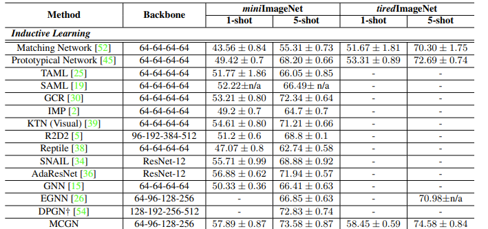
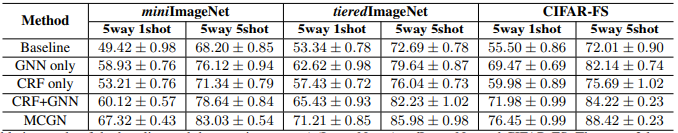

# Mutual CRF-GNN for Few-shot Learning

This readme file is an outcome of the [CENG502 (Spring 2022)](https://ceng.metu.edu.tr/~skalkan/ADL/) project for reproducing a paper without an implementation. See [CENG502 (Spring 2022) Project List]([https://github.com/sinankalkan/CENG502-Spring2021](https://github.com/CENG502-Projects/CENG502-Spring2022)) for a complete list of all paper reproduction projects.

# 1. Introduction

We chose Mutual CRF-GNN for Few-shot Learning  to implement as a term project within the scope of the CENG502 Advanced Deep Learning course. This paper is CVPR 2021 paper. We aim to achieve the same results as researchers by implementing this paper, which does not have open source code. Thus, we hope to create an open source for those who want to apply the method in the paper.

## 1.1. Paper summary

This paper brings a new method to GNN. Affinity is a critical part of GNN, and in general affinity is computed in feature space, and 
does not take fully advantage of semantic labels associated to these features.In this paper CRF(Conditional Random Field) is used on labels and features of support data to infer a affinity in the label space. This method is called as Mutual CRF-GNN (MCGN). Their results show that this method outperforms state of art methods on 5-way 1-shot and 5-way5-shot setting on datasets miniImageNet, tieredImageNet, and
CIFAR-FS.

# 2. The method and my interpretation

## 2.1. The original method

Few-shot learning aims to learn a model that can generalize well to new tasks with only a few labelled samples. Each few-shot task has a support set S and a query set Q. The support set S contains N classes with K samples for each class it is called as N-way K-shot. 

Let 

$$
\begin{equation}
\begin{aligned}
\mathbf{F}=\left(\mathrm{f}_{1}, \mathrm{f}_{2}, \ldots, \mathrm{f}_{N \times K+T}\right) \in \mathbb{R}^{(N \times K+T) \times p} 
\end{aligned}
\end{equation}
$$

be the collection of $N \times K + T$ feature vectors in one few shot task, where p is the feature dimension. Given an input 
$F_0 = F$ and the associated graph affinity 
$A_0 = A$, GNN conducts the following
layer-wise propagation in the hidden layers as 

$$
\begin{equation}
\mathbf{F}^{l+1}=\sigma\left(\mathbf{D}^{-1 / 2} \mathbf{A}^{l} \mathbf{D}^{-1 / 2} \mathbf{F}^{l}\right)
\end{equation}
$$

### Introducing CRF to GNN:
To produce the affinities A that consider contexts, this paper utilizes the marginal distribution of each random variable in CRFs to compute affinity in all GNN layers.
#### Unary Compatibility:

$$
\begin{equation}
\psi\left(u_{i}^{l}=m\right)
\end{equation}
$$

Unary compatibility is to describe the relation between the variable ui of support samples and its corresponding observation. Mathematically, it can be formulated as 

$$
\begin{equation}
\left\{\begin{array}{cl} 1-\eta & \text { if } m=y_{i} \\
\eta /(N-1) & \text { if } m \neq y_{i}
\end{array},\right.
\end{equation}
$$


#### Binary Compatibility:

$$
\begin{equation}
\phi\left(u_{j}^{l}=m, u_{k}^{l}=n\right)
\end{equation}
$$

Binary compatibility is to describe the relations between the connected
random variables, uj and uk. Mathematically, it can be formulated as 

$$
\begin{equation}
\phi\left(u_{j}^{l}=m, u_{k}^{l}=n\right)=\left\{\begin{array}{cl}
t_{2, k}^{l} & \text { if } m=n \\
\left(1-t_{j, k}^{l}\right) /(N-1) & \text { if } m \neq n
\end{array}\right.
\end{equation}
$$

#### Marginal Distribution:
The marginal distribution of variable ui is obtained by marginalizing out all random variables other than ui in CRF. They adopt the loopy belief propagation to calculate marginal distribution of each node in CRF.

$$
\begin{equation}
\mathbf{m}_{l, i \rightarrow j}^{r}=\left[\phi\left(u_{i}^{l}, u_{j}^{l}\right)\left(\left(\mathbf{b}_{l, i}\right)^{r-1} \oslash \mathbf{m}_{l, j \rightarrow i}^{r-1}\right)\right]
\end{equation}
$$

$$
\begin{equation}
\mathbf{P}\left(u_{i}^{l} \mid \mathbf{F}^{l}, \mathcal{Y}_{s}\right) \propto
\sum_{\mathcal{V}_{l}^{c r f} \backslash\{u_{i}^{l}\}}
\mathbf{P}\left(u_{1}^{l}, u_{2}^{l}, \ldots, u_{N K+T}^{l} \mid \mathbf{F}^{l}, \mathcal{Y}_{s}\right)
\end{equation}
$$

where r denotes the round index of belief propagation and r in the range 0 to R. R as the maximum round number, m is the message from ui to uj.

#### Affinity:
Marginal distribution  integrates both the contextual information in CRF and label information of support samples so to estimate affinity matrix,  marginal distribution is used.

$$
\begin{equation}
\hat{a}_{i j}^{l}=\mathbf{P}\left(u_{i}^{l}=u_{j}^{l}\right)=\sum_{m=1}^{N} \mathbf{P}\left(u_{i}^{l}=m\right) \mathbf{P}\left(u_{j}^{l}=m\right)
\end{equation}
$$

### Mutual CRF-GNN:
Mutual CRF-GNN (MCGN) enables GNN and CRF to help each other. For GNN, CRF provides valuable affinity A for feature transformation F. For
CRF, GNN provides better features F for inferring affinity A.

#### Initialization:
Given the images in the support set and the query set, the raw feature F is extracted by a CNN-based feature extractor f_emb.

$$
\begin{equation}
{F}^{1}=f_{e m b}(\mathcal{X}),
\end{equation}
$$

The initial affinity matrix A0 in GNN is initialized by semantic labels from the support set, 

$$
\begin{equation}
a_{i j}^{0}= 
\end{equation}
$$

$$
\begin{equation}
a_{i j}^{0}=\left\{\begin{array}{cc}
1 & \text { if } y_{i}=y_{j} \text { and } i, j \leq N \times K, \\
0 & \text { if } y_{t} \neq y_{j} \text { and } i, j \leq N \times K, \\
0.5 & \text { otherwise, }
\end{array}\right.
\end{equation}
$$

#### Feed-forward Implementation of MCGN:

• Step1: Given the affinity $A_l-1$ 
and output features  $F_l$ 
from the  $(l−1)$-th iteration, we estimate the unary and binary compatibility in the CRF. The estimated compatibility functions define the affinities between two connected random variables in CRF.

• Step2: The marginal distribution for random
variables in CRF is inferred by loopy belief propagation, using the compatibility functions obtained from Step 1 and the labels of samples in the support set.

• Step3: The affinities $A_l$ in GNN is derived from the marginal distributions obtained in step 2.

• Step4: The output features $F_{l+1}$ of the $l$-th iteration are computed by aggregating their neighboring features with $A_l$ as their weights.

Repeat above process layer by layer for $L$ iterations and
get the final output $F_{L+1}$ and affinity matrix $A_L$ for network
optimization and inference.

### Loss:

$$
\begin{equation}
\begin{aligned}
\mathcal{L}^{\epsilon r f} &=\sum_{1-N \times K}^{N \times K+T} \sum_{l=1}^{L+1} \mu_{l}^{c r f} \mathbf{C E}\left(\mathbf{P}\left(u_{1}^{l} \mid \mathbf{F}^{l}, y_{0}\right), y_{i}\right), \\
\mathcal{L}^{g n n} &=\sum_{1=N \times K}^{N \times K+T} \sum_{j=1}^{N \times K} \sum_{l=1}^{L} \mu_{l}^{g n n} \mathbf{B C E}\left(a_{i j}^{l}, c_{i j}\right)
\end{aligned}
\end{equation}
$$

where CE indicates the cross entropy, ${\mu_{l}^{c r f}}$ is the weights of each layer; 
$BCE$ indicates the binary cross entropy loss, $\mu_{l}^{g n n}$ is the weights of each layer, 
$c_{i j}$ is 1 if $y_i = y_j$ and 
0 if ${y_i \ne y_j}$.

The total objective function can be a weighted summation of two losses, 

$$
\begin{equation}
\mathcal{L}=\lambda_{\operatorname{crf}} \mathcal{L}^{\operatorname{crf}}+\lambda_{g n n} \mathcal{L}^{g n n}
\end{equation}
$$


## 2.2. Our interpretation 
Baseline of our code was taken from the following repos:

https://github.com/megvii-research/DPGN<br/>
https://github.com/ylsung/gnn_few_shot_cifar100

Aside from the backbone overall paper proposes to implement a different structure on top of it by using GNN and CRF. As the implementation and layer details were pretty under-explained in the paper we had to make a lot of assumptions. 

#### GNN:
For the GNN layer part they state the hidden layer formula but not the feature transformer and nonlinearity used on top of it with the dimension. We used layer sizes as [128,64,32] in the implementation and used ReLU activation for the linear transformations.

#### Binary Compatibility:
This was one of the significant assumptions we had to make. In this part binary compatibility is calculated from the cosine similarity between features and they define a piecewise function for it in the case of classes are the same. Since binary compatibility of query samples will also be computed here and we assume we don't know their labels in training time so it is unknown what the authors speak of regarding label in this part. We assumed that, using the piecewise function normally like the authors defined and for the query samples we only assumed that class is the same when the query sample we are calculating is the same with itself.

#### Loopy Belief Propogation:
As we have given in the method part, they have given the pseudo-code for loopy belief propogation and say that they follow the paper in the references [[1]](#1). From the cumulative knowledge of the original paper and the paper they refer we have concluded that belief should be a probability value and from the belief propogation they propose there doesn't seem to be a softmax on top of the calculated belief values. But following the paper[[1]](#1) we have added softmax layer on top of it. Another significant issue here is that in message propogation part binary compatibility is multiplied with the element-wise division of belief and message. Since binary compatibility can be 0 by following the formula(relu(cos_sim)), it produces zero by division error. We don't know how the authors avoided this situation but we have added a small epsilon while propogating message. Lastly, for belief propogation, messages are taken element-wise product for all the neighbors. But paper doesn't include a fact like what is a neighbor for a respective node. Since this is a CRF the edge affinities/probabilities is calculated at the end and essentially most have non-zero probabilities after some propogations. From this we inferred that neighbors are those with nonzero probability.

Aside from the above listed significant differences we have changed the layer dimensions in our experimens and mostly followed paper's implementations where it is possible.


# 3. Experiments and results

## 3.1. Experimental setup
In the paper for the training phase they used miniImageNet, tieredImageNet and Cifar-FS datasets. For few-shot evaluation they have experimented on 5way-1shot/5shot settings. Two backbone architectures are given in the paper which are ConvNet and ResNet12 which outputs 128-dimension embedding of the input. Adam optimizer is used for the training with $10^{-3}$. In ablation study they try the architecture permuations for GNN-only, CRF-only, CRF+GNN and MCGN. Lastly they presented results in both transductive and inductive settings.

For our implementation we have adopted all the same model settings but some training ones. We have only managed to try to train with Cifar-FS and miniImageNet datasets and 5way/1shot setting. For the backbone we have only used Resnet12. We tried the whole MCGN architecture and GNN-only architecture with inductive setting.


## 3.2. Running the code

### Required Packages:

-- pillow\
-- numpy\
-- pickle\
-- torch\
-- torchvision
### Directory Structure & Run
Source file root contains all the source code, \checkpoints directory holds all the training checkpoint models, \config directory specifies the .py files which include training settings. \dataset file contains \cifar-fs and \mini_imagenet folder which they include train,test and validation split pickled datasets.

After downloading the dataset and the packages following script will be run for training the MCRFGNN model and GNN only model:
```
python3 main.py --dataset_root dataset --config config/5way_1shot_resnet12_cifar-fs.py --num_gpu 1 --mode train --arch mcrfgnn

python3 main.py --dataset_root dataset --config config/5way_1shot_resnet12_cifar-fs.py --num_gpu 1 --mode train --arch gnn
```
For specifying the dataset any related config file can be given to the config argument from the config files.

For evaluation simply change --mode flag to test which can be seen by: 
```
python3 main.py --dataset_root dataset --config config/5way_1shot_resnet12_cifar-fs.py --num_gpu 1 --mode eval --arch mcrfgnn
```


## 3.3. Results
<p align="center">
  
  </p>
  <p align="center">
Figure 1: Accuracy results presented on paper 
</p>
<p align="center">
 
  </p>
  <p align="center">
Figure 2: Ablation accuracy results presented on paper
</p>

From our implementation of the model for MCGN architecture we couldn't train the network. From our experiments we have noticed that following the paper and our interpretations the network didn't seem to train after applying CRF. More specifically after trying CRF only architecture the backbone embedding first and a single CRF layer after the network seemed to have a vanishing gradient problem. Applying the full MCGN architecture didn't help also because of the previous reason so we haven't managed to observe any results as the results were mostly random. GNN only implementation was tried on ResNet12 backbone, but it returned pretty sub-par results on both Cifar-Fs and miniImageNet on end to end training where it's evaluation accuracies were %33 for Cifar-Fs and %26 for miniImageNet. GNN-only architecture also had some problems and those problems might be arising from a different reason than MCGN architecture which might be the data as when the data sources were different it achieved greater result in the original implementation of the model but our implementation fell short.


# 4. Conclusion

Overall the paper's idea to incorporate the similarity of features and aggregate them aside from GNN to produce affinity then aggregating node features in GNN is pretty logical and clever. But the amount of detail in the paper is really sub-par and flawed. In the base form of their proposed implementation there can be a zero-division during runtime which is a serious problem. The results we have produced were pretty sub-par and we have presented minimal amount of results. We have tried a lot of different things from changing the architecture and implementation, introducing new parts from the referenced papers but the results didn't change and we haven't managed to train it. 


# 5. References
<a id="1">[1]</a> 
S. Tang, D. Chen, L. Bai, K. Liu, Y. Ge and W. Ouyang, "Mutual CRF-GNN for Few-shot Learning," 2021 IEEE/CVF Conference on Computer Vision and Pattern Recognition (CVPR), 2021, pp. 2329-2339, doi: 10.1109/CVPR46437.2021.00236.


<a id="2">[2]</a> 
Jaemin Yoo, Hyunsik Jeon, and U Kang. Belief propagation
network for hard inductive semi-supervised learning. In International Joint Conference on Artificial Intelligence, pages
4178–4184, 2019

# Contact

Sena Eşme senaesme@hotmail.com

Batuhan Vardar batuhanvardar5@gmail.com
