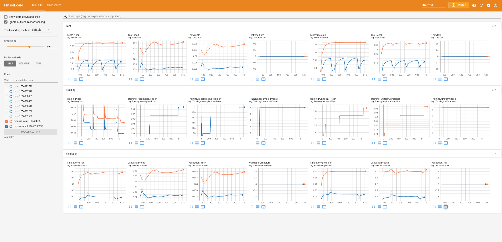

# Long-Tailed Multi-Label Visual Recognition by Collaborative Training on Uniform and Re-balanced Samplings

This readme file is an outcome of the [CENG502 (Spring 2022)](https://ceng.metu.edu.tr/~skalkan/ADL/) project for reproducing a paper without an implementation. See [CENG502 (Spring 2022) Project List](https://github.com/CENG502-Projects/CENG502-Spring2022)) for a complete list of all paper reproduction projects.

# 1. Introduction

The paper : [Long-Tailed Multi-Label Visual Recognition by Collaborative Training on Uniform and Re-balanced Samplings ]([https://openaccess.thecvf.com/content/CVPR2021/html/Guo_Long-Tailed_Multi-Label_Visual_Recognition_by_Collaborative_Training_on_Uniform_and_CVPR_2021_paper.html](https://openaccess.thecvf.com/content/CVPR2021/html/Guo_Long-Tailed_Multi-Label_Visual_Recognition_by_Collaborative_Training_on_Uniform_and_CVPR_2021_paper.html))

The paper is published in CVPR2021 and achieves state of the art results. On top of achieving state of the art results they actually develop a novel method. Our goal is to reproduce authors' results in the same way they did. They simply and judiciously add one of their novelties at a time and show its indiviual contribution. So our goal is to reproduce the table in img4 by adding one method at a time. Even if we can't get numerically close results to the paper's we would like to similar effects of each proposed method's addition. 

## 1.1. Paper summary

Re-sampling is highly utilized to improve long tailed datasets. Mutual learning [1] and co-regularization [2] with two subnets as in Figure 1 (a) were used to improve performance. 

  

  Figure 1

This paper adopts this network structure but feeds it with two different sampling methods of the same dataset as in Figure 2. Subnet-U is fed with uniform sampling where each individual sample has equal probility and Subnet-R is fed with re-balanced sampling so that each class has equal probability. Petrained Resnet50's last stage is used as the Subnet and the bottom part is used as Φ(phi) network.\
Re-balanced sampling can improve performance of tail classes but hurts the performance of head classes. So we can say that for this network structure Subnet-U accounts for head classes and Subnet-R accounts for tail classes. 

  

  Figure 2

The loss equation is given in equation 1. First and second terms at the right hand side of the equation are for Subnet-U and Subnet-R's classification outputs. The classification loss (Lcls) is simply a binary cross-entropy based classification loss. The losses in the hyper parameter λ(lambda) is are consistency losses. These losses are calculated using the dashed lines in Figure 2. The consistency losses on the cross-branches enforce the the subnets' outputs to be similar. 

  

  Equation 1

Using the different samplings and the developing a two-branch network together with a cross-branch loss to enforce consistenc is this paper's contribution. The paper's most important claim is to improve tail classes' performance without hurting head classes' performance. As can be seen in below table this claim is true and other papers can't achieve this. 

  

  Table 1

Lastly they introduce the logit compensation term for the classification loss (Lcls) in Equation 1. The paper explains the need as: "when using the weighted sigmoid cross entropy loss for classification, the imbalance between the numbers of positive and negative samples in each class could push their unbounded logit values away from zero with different distances, leading to class-specific over-fitting." For the solution they say "we assume that logit output of the network for each label recognition conforms to a normal distribution" and they simply enforce this. 

  

  Equation 2

The ablation results table which shows the indivual componets' effects show that logit compensation provides the least amount of gain of the introduced methods. Taking into consideration the main claim of this paper, we think this component is the least important among the methods introduced by this paper.

  

  Table 2

@TODO: Summarize the paper, the method & its contributions in relation with the existing literature.

# 2. The method and my interpretation

## 2.1. The original method

- Creating long tailed dataset from Pascal Voc and Ms Coco with Pareto distribution.
- Creating a Network, the shared bottom network is the conventional ResNet50 excluding the last stage. 
- For Subnet-U and Subnet-R, author states that first include an identical copy of the last stage of ResNet,After that, a linear classifier in the form of a fully connected layer is added to each branch.
- Conventional Classification Loss, Logit Compensation and Logit Consistency between Branches is used as loss function.
- Run inference for each input test image, the predictions of two branches are averaged as the final prediction result.

## 2.2. Our interpretation 

- Creating Long tailed dataset part is only explained with a sentence Pareto distribution used, we follow the references but could not found the exact way so we use the 6-6-8 split which explained in papers with 4-20 , 20-100 and 100-775 image sample intervals. 

  

  Figure 3

- We use Resnet50 Imagenet Pretrained model from torchvision model zoo, we are not sure that if its the same pretrained values. We split the network from last stage and try to create 2 subnet model from the excluding stage , to produce 20 class 1-hot vector we added linear layer with sigmoid activation layer. As you can see from the figure above , we split the network from stage 5 and create subnetworks.
- We used nn.BCEWithLogitsLoss() for Conventional Classification Loss and nn.MSELoss() for Logit Consistency. It is not explained clearly that how the uniform and resampled data will feed the system. What is the order ? The subnet interaction between each other were unclear. The interaction at the subnet among the net input from backbone, the and the output were unclear.
- For testing only one of the subnets (i.e Subnet-U) was only the respective subnet trained or was all the system trained then only the respective subnet used? We trained only respective subnet.
- Some parameters werw given but many were missing such as batch size, training epochs. We did not know if the mean substraction and normalized were applied? 
- The usage of validation set was unclear. We don't know how they used it , we split our training set as %90-%10.

# 3. Experiments and results

## 3.1. Experimental setup

@TODO: Describe the setup of the original paper and whether you changed any settings.\
Original paper used Pytorch 1.4.0 version but we used 1.12.0 .\
We use Pascal Voc 2012 as training and validation set , Pascal Voc 2007 as test set.
We create the network by changing the structure of Resnet50 model as stated in paper.
We tried to follow the same procedure while preparing Long Tailed dataset but our set is different inevitably.

## 3.2. Running the code

You can find our version of Long tailed Voc Dataset with these links. \
[Pascal VOC]([http://host.robots.ox.ac.uk/pascal/VOC/](http://host.robots.ox.ac.uk/pascal/VOC/)) \
[dataset_voc_test.zip]([https://drive.google.com/file/d/14zlzl8V-gI7f9hAlLgcZgoYSK9TJdBD7/view?usp=sharing](https://drive.google.com/file/d/14zlzl8V-gI7f9hAlLgcZgoYSK9TJdBD7/view?usp=sharing)) \
[dataset_voc_lt.zip]([https://drive.google.com/file/d/135dGh0ti0vvIbWeePVN66UQvkX8DKJAr/view?usp=sharing](https://drive.google.com/file/d/135dGh0ti0vvIbWeePVN66UQvkX8DKJAr/view?usp=sharing)) 

We used docker container with Pytorch 1.12.0 , Python 3.7.13 on Ubuntu 18.04 Desktop Pc. You can pull the latest docker image with these commands. \
`docker pull pytorch/pytorch:latest`  
`docker run --gpus all -v /guo2021:/guo2021 -w /guo2021 -it pytorch/pytorch:latest`

You can directly use our dataset.zip files by extracting them to dataset_voc_lt and dataset_voc_test or you can create your own version with \
`python src/createLongTailedDataset.py` \
`python src/createTestDataset.py`\
All the parameters can be found in configuration.py file. After setting paremeters properly you can directly run train.py file to start training. \
`python src/train.py` This code will store weight files in src/weight folder, you can use them later for testing. \
`python src/test.py` This code will run the test set.

├── dataset_org\
│   ├── VOCtest_06-Nov-2007\
│   ├── VOCtest_06-Nov-2007.tar\
│   ├── VOCtrainval_11-May-2012\
│   └── VOCtrainval_11-May-2012.tar\
├── dataset_voc_lt\
│   ├── dataset_voc_lt.zip\
│   ├── images\
│   ├── info.txt\
│   └── labels\
├── dataset_voc_test\
│   ├── dataset_voc_test.zip\
│   ├── images\
│   ├── info.txt\
│   └── labels\
├── dockerCommands.txt\
├── readme\
│   ├── img1.png\
│   ├── img20.jpeg\
│   ├── img21.png\
│   ├── img22.png\
│   ├── img2.png\
│   ├── img3.png\
│   ├── img4.png\
│   ├── img5.png\
│   └── img6.png\
├── README.md\
├── runs\
│   ├── resample\
│   └── uniform\
├── src\
│   ├── apmeter.py\
│   ├── ClassAwareSampler.py\
│   ├── configuration.py\
│   ├── createLongTailedDataset.py\
│   ├── createTestDataset.py\
│   ├── Network.py\
│   ├── __pycache__\
│   ├── test.py\
│   ├── train.py\
│   └── VocDataset.py\
└── weights_1.weights\

## 3.3. Results

Even though we used the suggested parameters in the paper, unfortunately the network overfits. Since we didn't want to employ other tools to prevent overfitting we tested other parameters but could not land on a good solution.

  

  Figure 4

we obtained some results, however we couldn't get numerically stable results as desired. We have several thoughts on what might be the cause. Head classes' performance are improvable but medium and tail classes are not as well as they are supposed to be. Obviously long tailed distribution is a challenging problem. 
At Figure 4 you can find the results of
- Uniform branch experiment
- Resampled branch experiment
- Uniform + Resampled branch experiment
- Uniform + Resampled + Logit consistinency

Both figures supports that the network overfits during training but could not learn medium and tail classes well. We believe the main reason would be the difference in LT dataset we create. 

  

  Figure 5

At Figure 5 you can find the mAP results of head,medium and tail classes with
- Uniform branch experiment
- Resampled branch experiment

# 4. Conclusion

We could't reach the succesfull result as paper does. Main reason could be the dataset conversion to LT . Head classes can be found but medium and tail classes are not accurate as head classes. We may have to change the creating LT dataset part of the codes. We may also need to investiga the rebalanced sampler if it has unintended behaviour.

# 5. References
- Network.py - https://deci.ai/blog/measure-inference-time-deep-neural-networks/
- ClassAwareSampler.py - https://github.com/open-mmlab/mmdetection 
- VocDataset.py - https://github.com/andrewssobral/deep-learning-pytorch/blob/master/segmentation/utils/dataset.py
- train.py - https://discuss.pytorch.org/t/is-there-any-nice-pre-defined-function-to-calculate-precision-recall-and-f1-score-for-multi-class-multilabel-classification/103353

- [1] (27th reference in the paper) Xuesong Niu, Hu Han, Shiguang Shan, and Xilin Chen. Multi-label co-regularization for semi-supervised facial action unit recognition. In Advances in Neural Information Processing Systems, pages 909–919, 2019. 1, 2, 3, 4, 7
- [2] (51th reference in the paper) Ying Zhang, Tao Xiang, Timothy M Hospedales, and Huchuan Lu. Deep mutual learning. In IEEE Conference on Computer Vision and Pattern Recognition, pages 4320– 4328, 2018. 1, 2, 3, 4, 7
- [3] Poudel, Sahadev & Kim, Yoon & Vo, Duc & Lee, Sang-Woong. (2020). Colorectal Disease Classification Using Efficiently Scaled Dilation in Convolutional Neural Network. IEEE Access. PP. 1-1. 10.1109/ACCESS.2020.2996770. 
# Contact

- Baran Gulmez\
baran.gulmez07@gmail.com\
[Linkedin](https://www.linkedin.com/in/baran-gulmez/) 
- Ibrahim Koc\
iibrahimkoc@gmail.com\
[Linkedin](https://www.linkedin.com/in/ibrahim-koc-swe/) 

