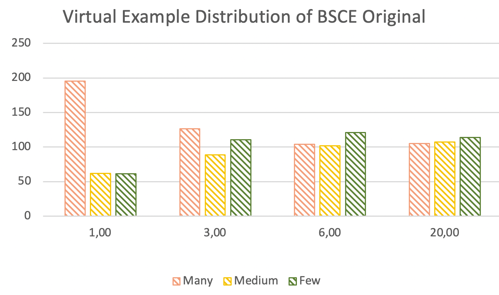

# Distilling Virtual Examples for Long-tailed Recognition

This readme file is to reproduce some of the results in the paper "Distilling Virtual Examples for Long-tailed Recognition<sup>1</sup>". The repository is forked from the [official implementation](https://github.com/jiawei-ren/BalancedMetaSoftmax-Classification) of the paper "Balanced Meta-Softmax for Long-Tailed Visual Recognition<sup>2</sup>" and modified accordingly to implement the DiVE method since it is the reference model in the DiVE method.

# 1. Introduction

The paper<sup>1</sup> is published at ICCV 2021 and it proposes a method to alleviate one of the most common problems in deep learning: The performance of the models for tail classes. It's been known that DNNs (deep neural networks) rely on a great number of data points and real life does not reflect properly curated datasets usually. Thus, our DNNs struggle in rare classes whose number of data points in the dataset is small.

## 1.1. Paper summary and the method

The paper starts by introducing the long-tail problem and states that models trained on the long-tailed dataset are biased towards head classes. It continues with the common methods trying to solve the problem: Resampling which tries to solve the problem by oversampling the rare classes or undersampling the head classes, and reweighting which tries to weight loss value of rare classes to make the DNN learn them better, and finally decoupling which tries to learn feature and classifier networks separately. The authors make a critic here about these methods by arguing they do not provide a cross-category interaction.

Then, the authors tell about the ***virtual example*** idea with the following simple example: Imagine a model outputs a prediction vector [0.7, 0.3] for a given dog image in a binary classification problem between dogs and cats and the number of cats is much smaller than the number of dogs. In this case, the prediction can be interpreted as a 0.7 dog image and 0.3 cat image. The important thing here is that we can make use of 0.3 cat image (virtual example) even if the original image belongs to the dog class and dogs and cats are not necessarily bear very similar visual features. Consequently, ***Virtual example distribution*** is defined as the summation of each category in the predictions of images in the training set. 

The main idea behind the proposed method DiVE is to distill the virtual examples. Therefore, we have a knowledge distillation step in which the student model takes advantage of virtual examples obtained from a teacher model. However, a simple model with cross-entropy loss is shown to have a long-tailed virtual example distribution just like the original distribution of the dataset. That's why it does not help much to student model and it's stated (and empirically supported) that the teacher models whose virtual example distribution is flatter lead the student model to better accuracy. To make the teacher model's distribution flatter we have two methods:

 1. Temperature:

<p align = "center">

</p>

Temperature is a scaler for the model outputs (logits). The effect of this scaling is that the more the temperature the flatter the distribution from softmax. However, as the temperature goes to infinity, the distribution becomes uniform which does not have any useful information in terms of classification.
 
 2. Power Normalization:

<p align = "center">

</p>

Power normalization is a process for taking a non-negative number and converting it to its given power. When the input is a vector, we also normalize each element by dividing by the sum. The usage of power normalization in the DiVE is that it further adjusts the distribution. Taking power normalization with p=0.5 equals doubling the temperature. It's stated in the paper that we can use power normalization without taking temperature to an unreasonable range.

Now that everything is in place, the training pipeline for the DiVE is as follows:

 1. Train a teacher model on a long-tailed dataset. (Balanced Meta-Softmax<sup>2</sup> is used in the paper)
 2. Tune temperature parameter $\tau$ with teacher model outputs and determine whether to use power normalization.
 3. Transform teacher logits using $\tau$ and power normalization.
 4. Minimize the following loss to train student model:


<p align = "center">

</p>

Here,

 - $a$ is the weight to balance the loss term between labels and KL-divergence loss between teacher and student models
 - $s^{BSCE}$ is the student model logits without temperature or power normalization applied
 - $y$ is the labels vector
 - $t^{\tau}$ is the student model logits with temperature and power normalization applied
 - $s^{\tau}$ is the student model logits with temperature

## 1.2 Main Contributions

The main contributions of the paper can be summarized as follows:

 - The paper brings another perspective to the output distribution of a deep model and defines the virtual example and virtual example distribution. It also shows that mathematically it has the same objective as DLDL<sup>3</sup>.
 - The authors indicate that virtual examples coming from original head class images help to learn tail classes.
 - The paper uses the knowledge distillation technique differently. Specifically, a student model tries to learn from a teacher model which ideally has a flatter virtual example distribution. The authors show two transformations to adjust the virtual example distribution of a model: Temperature scaling and power normalization.
 - The paper shows using this knowledge distillation with a teacher model having a flatter virtual example distribution increases accuracy in the student model.
 - The proposed pipeline is simple and does not have too many hyperparameters:
   - Teacher and student model can be the same architecture.
   - Virtual example distribution with given $\tau$ can be calculated without training a model again.
   - Nothing complex is required, the already known techniques are composed together with a novel idea of virtual examples. 


# 2. Experiments and results

## 2.1. Experimental setup

Because of hardware limitations, the experiments on the CIFAR-100-LT dataset are tried to reproduce. The training settings for the experiments in the paper are (same training in Bbn: Bilateral-branch network with cumulative learning for long-tailed visual recognition<sup>5</sup>):

 - ResNet-32<sup>4</sup> as backbone network.
 - Data augmentation strategy in <sup>4</sup>: randomly crop a 32 × 32 patch from the original image or its horizontal flip with 4 pixels padded on each side.
 - Stochastic gradient descent (SGD) to optimize networks with momentum of 0.9, weight decay of $2 × 10^{-4}$
 - 200 epochs with batch size being 128.
- The initial learning rate is 0.1 with first 5 epochs being linear warm-up, then deccayed at 120th and 160th epochs by 0.01.
- For the DiVE method, $\tau$=3, power normalization=0.5, and $a$ = 0.5.

## 2.2. Running the code

The environmental setup is done through docker. Also, to be able to work in the docker container easily, I put the required configuration to run the container in Visual Studio Code. The following command will build the image called "dive_pytorch_image" prescribed in Dockerfile in the repository. 

```bash
cd docker
docker build -t dive_pytorch_image .
```

Now we can open a container from this image inside Visual Studio Code:

 1. Open the repository in Visual Studio Code.
 2. Open "Command Palette" (Ctrl+Shift+P or Cmd+Shift+P).
 3. Select "Rebuild and Reopen in Container". This command will read the configuration under ".devcontainer" folder and open the container "502_pytorch_image".

Now open a terminal in Visual Studio Code to run various commands in the repository: train, test, virtual example distribution calculation, etc. I stick to the Balanced Meta-Softmax's<sup>2</sup> original command style and extend it. Some example commands:

```bash
### Calculate virtual example distribution for the model given in the config
### It will load model frozen and take a forward pass on training set. Then calculate
### virtual example distribution for 3 different categories as in the paper.
python main.py --cfg ./config/CIFAR100_LT/balanced_softmax_imba100.yaml --virtual_dist
python main.py --cfg ./config/CIFAR100_LT/balanced_softmax_imba100_bbn_recipe.yaml --virtual_dist
```
<br>

```bash
### Train teacher model (bsce)
### --cfg: config of the model to be trained
python main.py --cfg ./config/CIFAR100_LT/balanced_softmax_imba100_bbn_recipe.yaml
```
<br>

```bash
### Train the DiVE model with given teacher model
### --cfg: config of the model to be trained (DiVE's student model in this example)
### --teacher_model_path: path to the teacher model, we pass trained bsce model's final checkpoint
### --teacher_model_config: config file of the teacher model
### --weight: Weight between bsce loss term and knowledge distillation loss term. Should be [0,1]
### --power_norm: Power normalization hyperparameter mentioned in the paper. If given 1, power normalization will not be applied.
python main.py --cfg ./config/CIFAR100_LT/dive_bbn_recipe.yaml --teacher_model_path ./logs/CIFAR100_LT/models/resnet32_balanced_softmax_imba100_bbn_recipe/final_model_checkpoint.pth --teacher_model_config ./config/CIFAR100_LT/balanced_softmax_imba100_bbn_recipe.yaml --weight 0.5 --power_norm 0.5
```
<br>

```bash
### Test the DiVE model
### --cfg: config of the student model (DiVE)
### --test: evaluate the model in test set.
python main.py --cfg ./config/CIFAR100_LT/dive_bbn_recipe.yaml --test 
```

## 2.3. Results

First I calculate the virtual example distribution(left) for the train split of CIFAR-100-LT (INPUT), and 3 models using Cross-Entropy, BSCE, and DiVE loss. Also, virtual example distribution from the paper(right) is shown:

<p align = "center">


</p>
<p align = "center">
Figure-1 - Virtual Example Distribution from implementation(left) and paper(right)
</p>

<br>

Then I tried to reproduce the virtual example distribution(left) of CIFAR-100-LT of the BSCE model with different temperature values. Also, virtual example distribution from the paper(right) is shown:

<p align = "center">


</p>
<p align = "center">
Figure-2 - Virtual Example Distribution of BSCE with different &tau; values from implementation(left) and paper(right).
</p>

Even if the results match for $\tau$=3 and 6, it's quite different for $\tau$=1 (i.e. original logits without temperature scaling). As we can see in the next plots, this makes the dive perform worse than the BSCE model as opposed to the paper because the reason both temperature scaling and power normalization are used on teacher logits is that BSCE has a skewed virtual example distribution which tail classes suffer.

<br>

The following tables compare the accuracy results numerically. Since it's not completely clear if the training of BSCE was done with the original training scheme or DiVE's recipe (aforementioned BBN<sup>5</sup> recipe), I trained all 3 models I tried with both:

<p align = "center">


</p>
<p align = "center">
Figure-3 - Accuracy results of 3 models with original BSCE training recipe(left) and BBN training recipe(right)
</p>

<br>

<p align = "center">

</p>
<p align = "center">
Figure-4 - Accuracy results from the paper
</p>

First of all, BSCE's many shot accuracy and Cross-Entropy's low shot accuracy are a bit different between the two training recipes. However, the main accuracy of the teacher model BSCE is similar and DiVE behaves similarly with both teachers. Thus, I continue my experiments with the teacher trained with the BBN recipe.

Comparing accuracy results, even if the numbers are not exactly equal, the relation between Cross-Entropy and BSCE is reproduced. However, as it's expected and explained above, DiVE trained with the main hyperparameters set did not work because the teacher BSCE had different virtual example distribution than the original paper. Also, although DiVE gives a competitive overall accuracy, it performs much worse in the tail category which, again, can be explained with virtual example distribution difference. The average number of examples for the few-shot category in the virtual example distribution in the paper was lower than I get after training with the BSCE. Therefore, flattening the distribution further for the teacher model might have decreased the performance.

<br>

In the following experiments, I played with the temperature applied to the student. It can be understood from the paper after selecting $\tau$ based on virtual example distribution, half of the value is selected as a general temperature parameter. Then by applying power normalization with $p=0.5$, the teacher's temperature is doubled indirectly. Therefore, I kept the teacher temperature as 3 and applied power normalization while changing the student temperature:

<p align = "center">

</p>
<p align = "center">
Figure-5 - Accuracy results of DiVE with different student &tau; values
</p>

We can derive from the table that increasing student temperature trades many and few shot accuracies off while keeping accuracy mostly the same. Compared with the teacher model BSCE, DiVE with high student temperature (9, 12) has more accuracy in the few-shot but less accuracy in the many-shot and cannot surpass BSCE in overall accuracy. This behavior is expected as whatever the model learns we make the distribution very flat with high temperature and then pass it to the knowledge distillation loss term. Therefore, it can limitedly be similar to the teacher which still has a much more average number of virtual examples for the many-shot category(cf. Figure 1)

<br>

Going back to the problem discussed in the section under Figure 2, it can be stated that increasing the flatness level of virtual example distribution for a teacher whose distribution is already flatter than expected for the few-shot category hurts performance. Also, increasing student temperature does not compensate for this. Hence, simply, not using power normalization to double the temperature effect may help. The following table shows another set of experiments where the teacher and student use the same temperature and power normalization is not used:

<p align = "center">

</p>
<p align = "center">
Figure-6 - Accuracy results of DiVE with different &tau; values while power normalization is disabled
</p>

As we can easily see, keeping the intended difference between the teacher and student models and not losing useful information by disabling flattening teacher distribution too much solve our problem. Different $\tau$ values robustly improve our performance over the teacher model. Specifically, DiVE with $\tau$=6 without power normalization has better accuracy than its teacher in the many-shot category by 3,47%, in the medium-shot category by 3,40%, in the few-shot category by 3,27%, and in the overall accuracy by 3,40%. In summary, we managed to reproduce approximately 3% accuracy improvement in overall accuracy (The original paper did not share accuracy for three frequency categories).

<br>

# 3. Conclusion

The paper introduces an easy-to-use training pipeline to improve tail-class performance on the visual classification task. The idea is to use a teacher model to distill its virtual examples meaning to use its predictions as if they are weighted real examples in the dataset. By getting the idea from the DLDL3<sup>3</sup>, it has an objective function with two parts: one penalizes differences from original labels and one penalizes differences from the teacher model. The architecture is flexible to use any model as a student or teacher. Furthermore, the two most important hyperparameters can be tuned without retraining.

# 4. References

<sup>1</sup> He, Yin-Yin, Jianxin Wu, and Xiu-Shen Wei. "Distilling virtual examples for long-tailed recognition." _Proceedings of the IEEE/CVF International Conference on Computer Vision_. 2021.
<br>
<sup>2</sup> Ren, Jiawei, et al. "Balanced meta-softmax for long-tailed visual recognition."  _Advances in neural information processing systems_  33 (2020): 4175-4186.
<br>
<sup>3</sup> Gao, Bin-Bin, et al. "Deep label distribution learning with label ambiguity."  _IEEE Transactions on Image Processing_  26.6 (2017): 2825-2838.
<br>
<sup>4</sup> He, Kaiming, et al. "Deep residual learning for image recognition." _Proceedings of the IEEE conference on computer vision and pattern recognition_. 2016.
<br>
<sup>5</sup> Zhou, Boyan, et al. "Bbn: Bilateral-branch network with cumulative learning for long-tailed visual recognition." Proceedings of the IEEE/CVF conference on computer vision and pattern recognition. 2020.
<br>


# Contact

Ertuğrul Güngör - ertugungor@gmail.com / https://www.linkedin.com/in/ertugungor

