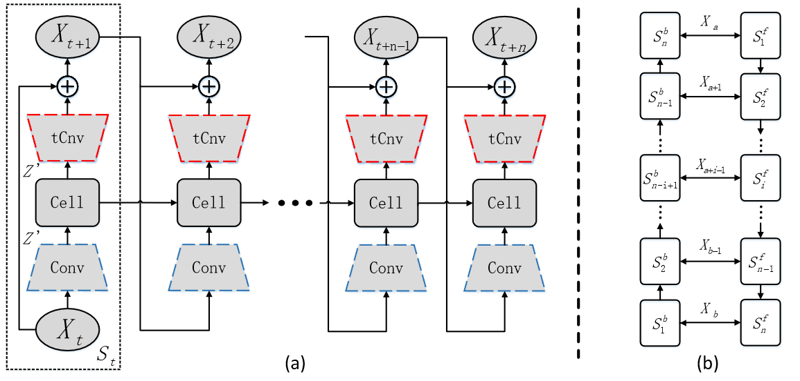
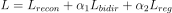
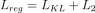

# Synthesizing Mesh Deformation Sequences with Bidirectional LSTM (incomplete)

This readme file is an outcome of the [CENG502 (Spring 2022)](https://ceng.metu.edu.tr/~skalkan/ADL/) project for reproducing a paper without an implementation. See [CENG502 (Spring 2022) Project List]([https://github.com/sinankalkan/CENG502-Spring2021](https://github.com/CENG502-Projects/CENG502-Spring2022)) for a complete list of all paper reproduction projects.

# 1. Introduction

This is an unofficial and incomplete implementation of [Synthesizing Mesh Deformation Sequences with Bidirectional LSTM by Qiao et al.](https://ieeexplore.ieee.org/document/9217964).

## 1.1. Paper summary

Computer animation is an important subfield of computer graphics, especially for the film and game industries. Synthesizing realistic animation sequences is an important but tedious task. In the literature, there are some works that propose interpolation and extrapolation techniques for this problem but most of them are not learning based.

In recent years, researchers started to utilize deep neural networks but these methods work on individual meshes. Going beyond that and understanding the temporal relationship between meshes in a sequence was unexplored until this work. So, this is the first study that attempts to use temporal information. Moreover, as shown in the Figure 10 in the paper, this method allows users to generate different sequences with the same input mesh by using random initial states. This can be a desirable property for animation sequences, for example the ones used video games, as it will help developers to make the characters look more alive.

# 2. The method and my interpretation

## 2.1. The original method

  
  <i>Figure 1. The overall architecture of the proposed network. Taken from the original paper[1].</i>

At first, we have to find a good representation for our shapes. In this work, a shape deformation representation called As-Consistent-As-Possible (ACAP)[7] is used. With this representation, we get a feature vector of size 9 for each vertex of the mesh. Before feeding these representation in the network, these feature vectors are normalized between [-0.95, 0.95] as it makes these vectors more suitable for tanh activation functions used in the convolution modules.

The computed feature vectors are first sent to convolution modules, which refer to mesh convolutional operations as defined in [8] and [9]. Then, the output of the convolution modules are sent to LSTM cells and their output is sent back to transpose convolution modules, which basically mirror the convolution modules. In the final step, their output is combined with the original mesh representation to get the representation of next mesh in the sequence.

As shown in Figure 1 (b), the bidirectional LSTM network proposed in the paper consists of two chains: forward and backward. They are equivalent in terms of architecture. The only difference between them is their direction. The network expects the first model in the animation sequence to be sent as input to forward chain. On the other hand, the input for the backward chain is the last model in that sequence. By generating models in reverse directions, the network aims to get the same output mesh for each time step. Using two separate chains for the method helps us to 
* reduce the number of trainable parameters,
* prevent overfitting.

For training the network, four different loss functions are used:
* Reconstruction loss: Forces sequences generated by the forward and backward chains to resemble their original sequence in the dataset
* Bidirectional loss: Forces sequences generated by the forward and backward chains for a time step to resemble each other
* L2 loss: Regularizes the network and mitigate overfitting
* KL loss: Helps the network to learn a good distribution of shapes

So, the final form of the loss function is as follows:

  

, where

  

## 2.2. Our interpretation 

@TODO: Explain the parts that were not clearly explained in the original paper and how you interpreted them.

# 3. Experiments and results

Not available.

# 4. Conclusion

@TODO: Discuss the paper in relation to the results in the paper and your results.

# 5. References

[1] Y. -L. Qiao, Y. -K. Lai, H. Fu and L. Gao, "Synthesizing Mesh Deformation Sequences With Bidirectional LSTM," in IEEE Transactions on Visualization and Computer Graphics, vol. 28, no. 4, pp. 1906-1916, 1 April 2022, doi: 10.1109/TVCG.2020.3028961.

[2] Gerard Pons-Moll, Javier Romero, Naureen Mahmood, and Michael J. Black. 2015. Dyna: a model of dynamic human shape in motion. ACM Trans. Graph. 34, 4, Article 120 (August 2015), 14 pages. https://doi.org/10.1145/2766993

[3] Matthew Loper, Naureen Mahmood, Javier Romero, Gerard Pons-Moll, and Michael J. Black. 2015. SMPL: a skinned multi-person linear model. ACM Trans. Graph. 34, 6, Article 248 (November 2015), 16 pages. https://doi.org/10.1145/2816795.2818013

[4] Dragomir Anguelov, Praveen Srinivasan, Daphne Koller, Sebastian Thrun, Jim Rodgers, and James Davis. 2005. SCAPE: shape completion and animation of people. ACM Trans. Graph. 24, 3 (July 2005), 408–416. https://doi.org/10.1145/1073204.1073207

[5] Lin Gao, Jie Yang, Yi-Ling Qiao, Yu-Kun Lai, Paul L. Rosin, Weiwei Xu, and Shihong Xia. 2018. Automatic unpaired shape deformation transfer. ACM Trans. Graph. 37, 6, Article 237 (December 2018), 15 pages. https://doi.org/10.1145/3272127.3275028

[6] L. Gao, Y. -K. Lai, J. Yang, L. -X. Zhang, S. Xia and L. Kobbelt, "Sparse Data Driven Mesh Deformation," in IEEE Transactions on Visualization and Computer Graphics, vol. 27, no. 3, pp. 2085-2100, 1 March 2021, doi: 10.1109/TVCG.2019.2941200.

[7] L. Gao, Y. -K. Lai, J. Yang, L. -X. Zhang, S. Xia and L. Kobbelt, "Sparse Data Driven Mesh Deformation," in IEEE Transactions on Visualization and Computer Graphics, vol. 27, no. 3, pp. 2085-2100, 1 March 2021, doi: 10.1109/TVCG.2019.2941200.

[8] David Duvenaud, Dougal Maclaurin, Jorge Aguilera-Iparraguirre, Rafael Gómez-Bombarelli, Timothy Hirzel, Alán Aspuru-Guzik, and Ryan P. Adams. 2015. Convolutional networks on graphs for learning molecular fingerprints. In Proceedings of the 28th International Conference on Neural Information Processing Systems - Volume 2 (NIPS'15). MIT Press, Cambridge, MA, USA, 2224–2232.

[9] Qingyang Tan, Lin Gao, Yu-Kun Lai, Jie Yang, and Shihong Xia. 2018. Mesh-based autoencoders for localized deformation component analysis. In Proceedings of the Thirty-Second AAAI Conference on Artificial Intelligence and Thirtieth Innovative Applications of Artificial Intelligence Conference and Eighth AAAI Symposium on Educational Advances in Artificial Intelligence (AAAI'18/IAAI'18/EAAI'18). AAAI Press, Article 299, 2452–2459.

# Contact

_Please feel free to contact me by email, if you need any further information or have any questions (furkankdem [at] gmail.com)_
