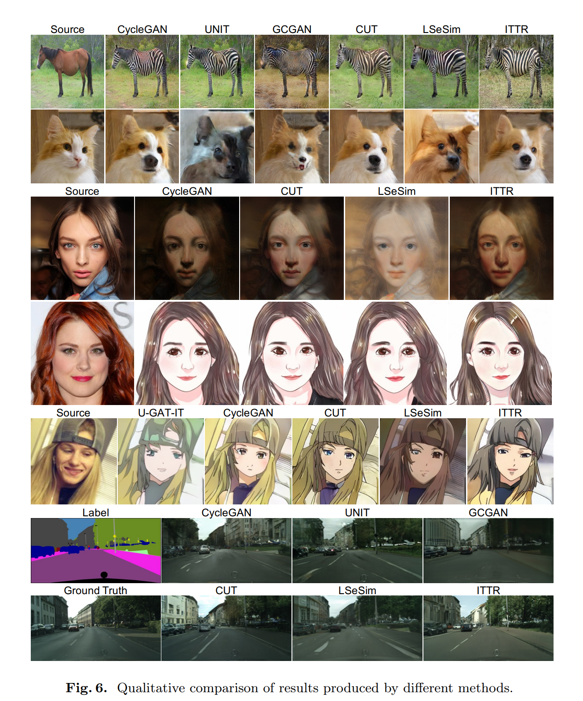
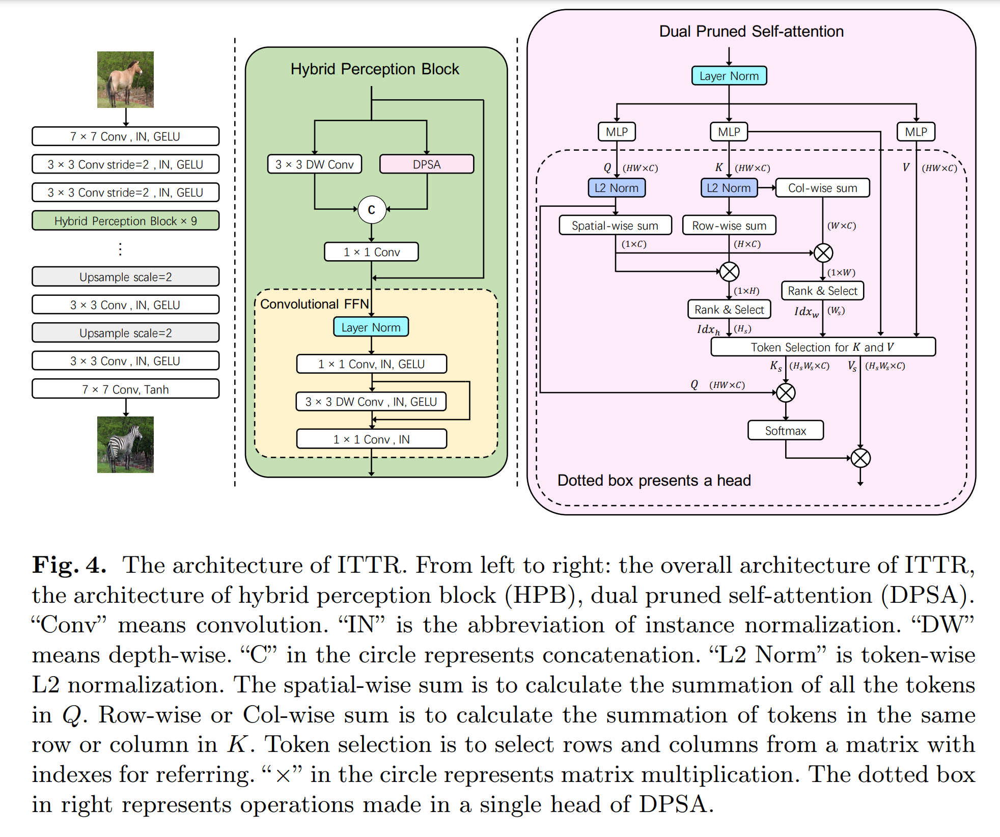
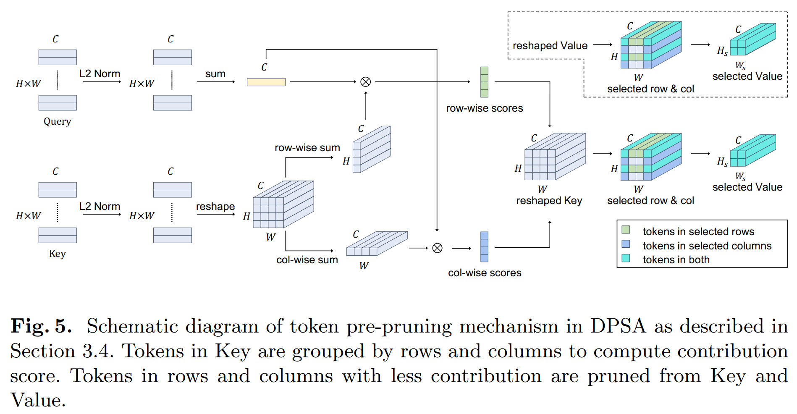
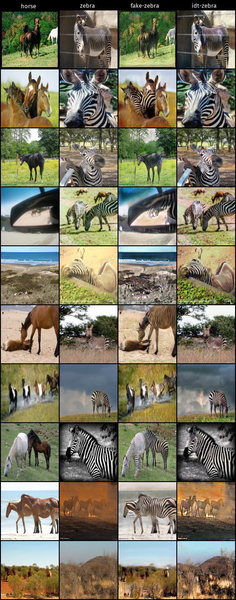
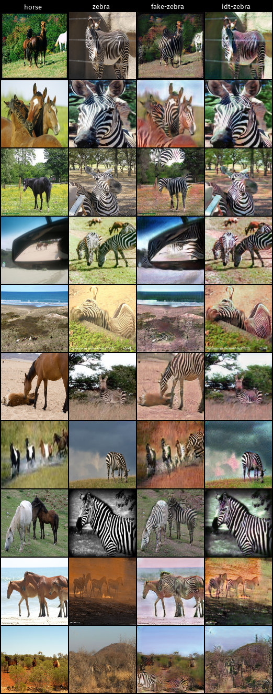

# ITTR: Unpaired Image-to-Image Translation with Transformers
This readme file is an outcome of the [CENG502 (Spring 2022)]([https://ceng.metu.edu.tr/~skalkan/ADL/](https://ceng.metu.edu.tr/~skalkan/ADL/)) project for reproducing a paper without an implementation. See [CENG502 (Spring 2022) Project List]([[https://github.com/sinankalkan/CENG502-Spring2021](https://github.com/CENG502-Projects/CENG502-Spring2022)](https://github.com/sinankalkan/CENG502-Spring2021](https://github.com/CENG502-Projects/CENG502-Spring2022))) for a complete list of all paper reproduction projects.
# 1. Introduction
* This article[1] was published in 2022 by Li et al. It is a very recent article and has not yet been published in any conference or journal. However, the results they provide are quite impressive.
* The aim of this project is:
  * To implement Hybrid Perception Block(HPB) and Dual Pruned Self-Attention(DPSA) blocks that are proposed in the ITTR paper.
  * To simplify [Contrastive Learning for Unpaired Image-to-Image Translation]([https://arxiv.org/pdf/2007.15651.pdf](https://arxiv.org/pdf/2007.15651.pdf)) paper implementation which is a base method for the ITTR paper.
  * To reproduce results for the Horse2Zebra which is a classic unpaired image-to-image dataset.
<p align="center">

</p>

## 1.1. Paper summary
This paper tries to solve unpaired image-to-image problem by using transformer based generator architecture.  CNN-based generators have been used many times for this task with good results. However, CNN-based generators lack the ability to capture long-range dependency. The ability of transformers-based models to capture long-range dependence has been demonstrated in previous studies but they have been applied recognition tasks generally. Transformer based models are costly and slow for the dense prediction tasks such as image-to-image translation. In this paper, they propose efficient and effective generator architecture ITTR, which contains transformer-based blocks.
<p align="center">

</p>

# 2. The method and my interpretation
## 2.1. The original method
In this paper, CUT[2] is used as base model. They train ITTR model with the same way as the CUT[2]. CUT is the single stage unpaired image-to-image translation model that uses contrastive learning.
ITTR uses HPB block in the generator body instead of using classic residual blocks. HPB block contains two branch to exploit both local and global features. Local branch uses convolutional layer and global branch uses an approach similar to self-attention.
Self-attention like block is named as Dual Pruned Self-Attention(DPSA). They aim to decrease computational cost of the self-attention using token contribution computation before the attention map estimation.
### Contrastive Unpaired Translation (CUT) Recap
<p align="center">

</p>

### ITTR Architecture
<p align="center">

</p>

### Dual Pruned Self-Attention(DPSA)
<p align="center">

</p>

## 2.2. My interpretation
Horse2zebra task can be translated by using CUT approach but selfie2anime or female2cartoon datasets could not be trained. For these cartoonization tasks may be using style transfer based training should be more meaningful. However, in the paper they did not mention anything about this problem. When I tried to train cartoonization task with the CUT, output image was similar to input normal image without any style from the cartoon target.
# 3. Experiments and results
## 3.1. Experimental setup
To make fair comparison, they use the same training pipeline the CUT. PatchGAN discriminator is used. Input images have fixed resolution 256x256. Adam optimizer is used with the 2e-4 learning rate. Batch size is set to 1. Learning rate is reduced to zero linearly after first 200 epochs. The whole training takes 400 epochs. Experiments are performed on NVIDIA GeForce RTX 2080Ti. Implementation differs from the paper are below:
* I have reduced learning rate after each 10 epoch by using 0.5 multiplier. Generator was converged quicker by using this strategy.
* Model trainings take 100 epoch.
## 3.2. Running the code
* “lib” folder contains the whole implementations.
* “trainer” folder has the CUT training strategy implementations.
* “loss” folder contains loss functions is used in the CUT.
* “models” folder contains CUT and ITTR generator, discriminator and projection model implementations.
* “config” folder has the all necessary hyperparameters for the both CUT and ITTR models.
#### Dataset
* Set up your environment using a requirements.txt
* Download dataset from [here](https://people.eecs.berkeley.edu/~taesung_park/CycleGAN/datasets/).
* Change the dataset path field in the config file (i.e in ITTR.json, ...).
#### Training
```
python train.py --config ./configs/ITTR.json
```
```
python train.py --config ./configs/CUT.json
```
<i>To continue from the saved checkpoint you can use resume argument:</i>
```
python train.py --config ./configs/ITTR.json --resume ./saved/ITTR/<experiment-date>/checkpoints/checkpoint-epochX.pth
```
#### Test
You need to change deployment.best_model field in the config file with the best checkpoint path.
```
python test.py --config ./configs/ITTR.json --image image/folder/path --out-dir output/dir/path
```
## 3.3. Results
Qualitative comparison between CUT and ITTR models are provided below. Each model trained with the same hyperparameters. 60.epoch checkpoints are used to generate outputs.
<p align="center">
<b> CUT Results are shown below </b>
</p>
<p align="center">

</p>

<p align="center">
<b> ITTR Results are shown below </b>
</p>
<p align="center">

</p>


# 4. Conclusion
Out of these results, the contrastive unpaired translation (CUT) results and the ITTR approach results from my implementation seem to be on par with each other. Some observations are as follows: CUT gets the colors more correct, while ITTR tends to destroy the color information   in the input image. On the other hand, ITTR seems to be more successful in capturing and installing the zebra stripe pattern to the target images, since it's more liberal with color modifications. The best of both worlds would be a version of ITTR with more of a foreground/background awareness for the object to be domain-mapped. One final note is that these observations pertain to ITTR as has been trained on my custom implementation: It may be the case that there are unnoticed bugs in the implementation, sub-optimal hyper-parameters, or simply the model might need a bit more time to converge to a better optimum.
# 5. References
1. Zheng, Wanfeng, et al. "ITTR: Unpaired Image-to-Image Translation with Transformers." arXiv preprint arXiv:2203.16015 (2022).
2. Park, T., Efros, A.A., Zhang, R., Zhu, J.Y.: Contrastive learning for unpaired image-to-image translation. In: ECCV. pp. 319–345. Springer (2020)
# Contact
Onur Can ÜNER - [onur.uner@metu.edu.tr](onur.uner@metu.edu.tr) 